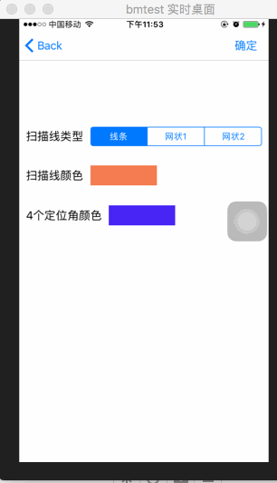
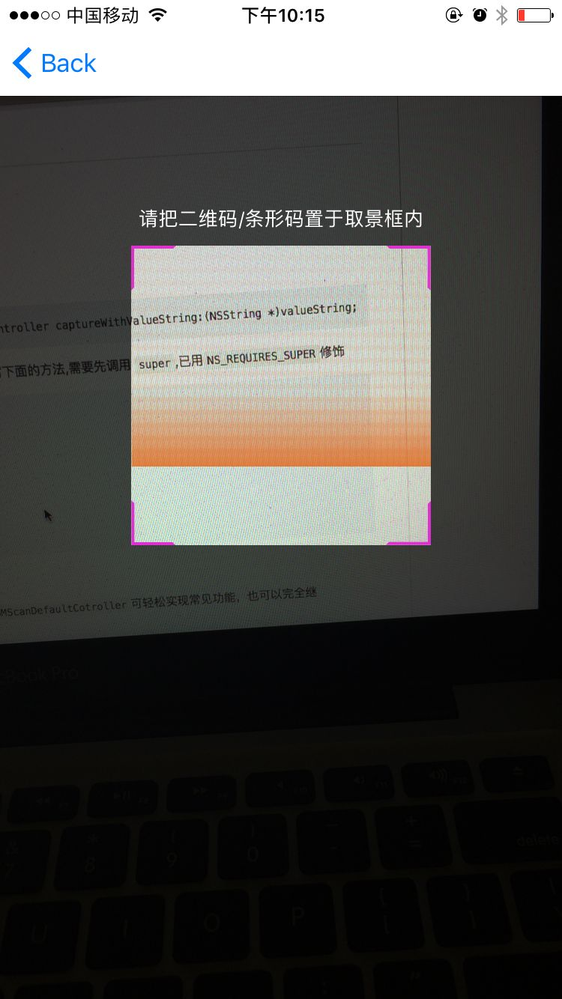
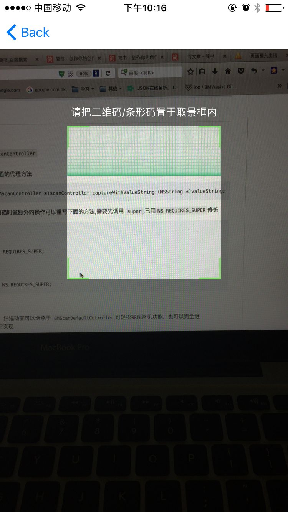
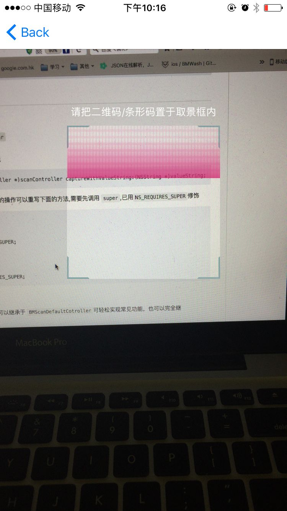

# BMScan
> 对系统扫描功能的封装，集成了扫描相关 UI 和自定义识别区域等功能，最简单的使用需要继承于 `BMScanController` 或者 `BMScanDefaultCotroller`即可。     

## 功能描述
- 扫描二维码/条形码
- 自定义扫描UI（半透明区域，扫描脚UI，扫描线，扫描动画）均可自定义修改参数
- 敏感区域自定义
- 闪光灯
- 识别相册图片中的二维码
- 识别图片中的二维码
- 扫描成功语音和震动提示
- 双击拉近镜头（待加入）
- 生成功二维码/条形码（待加入）
- ...

 
[](http://cocoapods.org/pods/SMCustomViewXIB) 
[](http://cocoapods.org/pods/SMCustomViewXIB) 
[](http://cocoapods.org/pods/BMScan) 
[](https://www.apple.com/nl/ios/) 
[](http://weibo.com/liangdahong) 
[](https://github.com/asiosldh/BMScan/stargazers)

## 效果图 






>其中`半透明区域颜色`，`扫描区域尺寸和位置`，`扫描区域4脚的颜色`，`扫描线条的颜色和样式`均可以自定义。

## CocoaPods
CocoaPods is the recommended way to add BMScan to your project.
Add a pod entry for BMScan to your Podfile.

```Ruby
pod 'BMScan', '~> 0.1.7'
```		
Second, install BMScan into your project:

```Ruby
pod install
```

## 使用说明
###说明

###API说明
#### 扫描到内容时
```c
/**
 扫描到内容时回调
 */
- (void)scanCaptureWithValueString:(NSString *)valueString NS_REQUIRES_SUPER;
```
#### 扫描控制
```c
/**
 开始扫描
 */
- (void)startScanning NS_REQUIRES_SUPER;

/**
 结束扫描
 */
- (void)closureScanning NS_REQUIRES_SUPER;
```

#### 自定义透明扫描区域
```c
/**
 扫描区域 X 值
 */
- (CGFloat)areaX;

/**
 扫描区域 Y 值
 */
- (CGFloat)areaY;

/**
 扫描区域 Width 值
 */
- (CGFloat)areaWidth;

/**
 扫描区域 Height 值
 */
- (CGFloat)areaXHeight;
```

#### 标题距扫描区域的距离
```c
/**
 标题距扫描区域的距离
 */
- (CGFloat)areaTitleDistanceHeight;
```

#### 非扫描区域的颜色（半透明区域）
```c
/**
 非扫描区域的颜色
 */
- (UIColor *)areaColor;
```

#### 4个拐脚的颜色
```c
/**
 脚颜色
 */
- (UIColor *)feetColor;
```

#### 4个拐脚的颜色分别自定义
```c
/**
 左上脚颜色
 */
- (UIColor *)leftTopColor;

/**
 左下脚颜色
 */
- (UIColor *)leftBottonColor;

/**
 右上脚颜色
 */
- (UIColor *)rightTop;

/**
 右下脚颜色
 */
- (UIColor *)rightBotton;
```

#### 扫描线颜色
```c
/**
 扫描线条颜色

 @param scanController 扫描控制器
 @return 颜色值
 */
- (UIColor *)scanfLinInscanController:(BMScanController *)scanController;
```

#### 扫描条动画
```c
/**
 扫描线条动画
 */
- (BMScanLinViewAnimation)scanLinViewAnimation;
```

#### 扫描条类型
```c
/**
 扫描线条类型
 */
- (BMScanLin)scanLin;
```

#### 可识别区域
##### 设置可识别区域

>如果继承于`BMScanDefaultCotroller`不需要考虑，内部会由扫描区域来确定`可识别区域`,如果有特殊要求可才重写如下方法

```c
/**
 设置可以识别区域
 */
- (CGRect)rectOfInterest;
```

##### 动画时间

```c
/**
动画时间
*/
- (CFTimeInterval)animationDuration;
```

##### 是否隐藏闪光灯按钮 默认打开

```c
/**
是否隐藏闪光灯按钮 默认打开
*/
- (BOOL)hidenLightButton;
```

##### 刷新可识区域

```c
/**
 刷新可识区域
 */
- (void)updateRectOfInterest;
```

##### 刷新扫描UI
```c
/**
 刷新扫描UI
 */
- (void)updateScanUI;
```

### 方法预览

- 文档可能更新不及时，请以具体代码为准。
- [cocoapods在线文档](http://cocoadocs.org/docsets/BMScan/0.1.3/)

## Contacts
> 项目中示例代码暂未处理，只是简单的实现了部分演示，感谢[Color-Picker-for-iOS](https://github.com/hayashi311/Color-Picker-for-iOS)

##### Sina : [@梁大红](http://weibo.com/3205872327)
##### blog : [@idhong](http://idhong.com)
##### 有任何问题可与我联系

## MIT

- 欢迎 Fork 🍴 和 Star ⭐️
